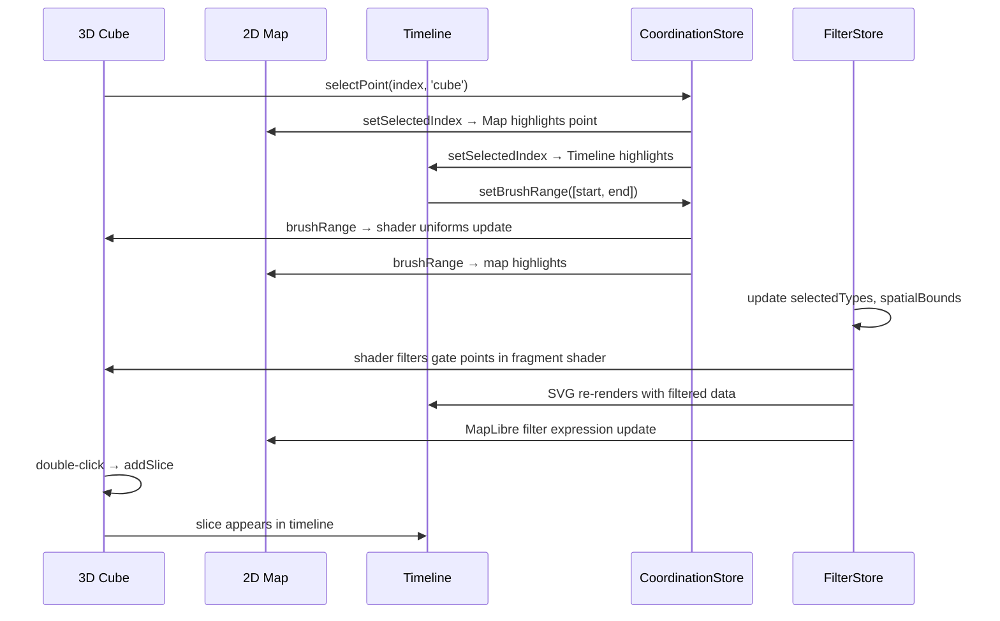

# Visualization Strategy

**Analysis Date:** 2026-06-25

## Overall Architecture

The application implements a **coordinated multi-view visualization** (CMV) pattern with three primary views:

1. **3D Space-Time Cube** — Primary view: crime events in a 100x100x100 normalized volume (X=lon, Y=time, Z=lat)
2. **2D Map** — Geographic crime overlay on MapLibre/Mapbox basemap
3. **Dual Timeline** — SVG-based timeline with overview + detail + density tracks

All views are synchronized via Zustand stores and a coordination store (`src/store/useCoordinationStore.ts`).

## Data Flow

```
DuckDB (CSV files)
  → API Routes (/api/crime/*, /api/adaptive/*, /api/stkde/*)
    → TanStack Query (useCrimeData, useViewportCrimeData)
      → ColumnarData (Float32Array, Uint8Array arrays)
        → [3D Cube] InstancedMesh with shader-based rendering
        → [2D Map]  MapLibre layers + DeckGL heatmap overlay
        → [Timeline] SVG via @visx visualization primitives
```

### Columnar Data Format

**Defined in:** `src/types/data.ts`

```typescript
interface ColumnarData {
  x: Float32Array;          // Normalized X (-50 to +50)
  z: Float32Array;          // Normalized Z (-50 to +50)
  lat?: Float32Array;       // Geographic latitude
  lon?: Float32Array;       // Geographic longitude
  timestampSec: Float64Array; // Epoch seconds
  timestamp: Float32Array;  // Normalized time (0-100)
  type: Uint8Array;         // Crime type IDs
  district: Uint8Array;     // Police district IDs
  block: string[];          // Block identifiers
  length: number;
}
```

This format is shared across all three views. The `timestamp` field (normalized 0-100) is the primary time dimension used by the 3D cube and timeline; `timestampSec` is used for geographic accuracy on the map.

### Rendering Technology Per View

| View | Technology | Purpose |
|------|-----------|---------|
| 3D Cube | React Three Fiber (Three.js) | Space-time density exploration |
| 2D Map | MapLibre GL + React Map GL | Geographic crime overlay |
| Heatmap | DeckGL HeatmapLayer | Density aggregation on map |
| Timeline | @visx (SVG) | Time series, brushing, adaptive scaling |
| Charts | @visx/shape, d3 | Statistics, histograms |
| STKDE | Canvas 2D (heatmap cells) | Spatiotemporal kernel density |

## View Coordination

### Store Architecture

**Zustand stores** used for cross-view state:

| Store | File | Shared State |
|-------|------|-------------|
| `useCoordinationStore` | `src/store/useCoordinationStore.ts` | `selectedIndex`, `brushRange`, `syncStatus`, `workflowPhase` |
| `useFilterStore` | `src/store/useFilterStore.ts` | `selectedTypes`, `selectedDistricts`, `selectedTimeRange`, `selectedSpatialBounds` |
| `useTimeStore` | `src/store/useTimeStore.ts` | `timeScaleMode`, `timeRange`, `currentTime` |
| `useAdaptiveStore` | `src/store/useAdaptiveStore.ts` | `warpFactor`, `warpMap`, `densityMap`, `burstinessMap` |
| `useSliceStore` | `src/store/useSliceStore.ts` | `slices`, `activeSliceId` |
| `useClusterStore` | `src/store/useClusterStore.ts` | `clusters`, `selectedClusterId` |
| `useTimelineDataStore` | `src/store/useTimelineDataStore.ts` | `columns`, `data`, `minTimestampSec` |
| `useUIStore` | `src/store/ui.ts` | `mode`, `showContext`, `contextOpacity` |

### Coordination Flow



## View-Specific Strategies

### 3D Cube Strategy

- **Use `InstancedMesh`** for maximum GPU performance with potentially millions of points (single draw call)
- **Shader-based filtering** avoids CPU-side iteration for filter changes — uniforms updated, fragment shader discards
- **Adaptive time warping** via 1D data texture lookup in vertex shader
- **LOD system** via uniform scalar on vertex positions (shrinks points at distance)
- **Focus+Context** technique: bright in-focus points near time plane, dim ghosted context points

### Timeline Strategy

- **Dual timeline** (`src/components/timeline/DualTimeline.tsx`): Overview (full range) + Detail (focused range)
- **SVG-based** via @visx: efficient for 2D vector rendering of ~1000 bins
- **Brush interaction** for range selection, linked to 3D cube via `useCoordinationStore`
- **Density area chart** (`src/components/timeline/DensityAreaChart.tsx`) below timeline
- **Adaptive controls** (`src/components/timeline/AdaptiveControls.tsx`) for warp factor, burst settings

### Map Strategy

- **MapLibre GL** for basemap rendering (dark/light/positron styles)
- **DeckGL HeatmapLayer** (`src/components/map/DeckGlHeatmapOverlay.tsx`) for geographic density overlay
- **Custom overlay layers** in `src/components/map/`:
  - `MapHeatmapOverlay.tsx` — Crime heatmap
  - `MapStkdeHeatmapLayer.tsx` — STKDE hotspot overlay
  - `MapClusterHighlights.tsx` — DBSCAN cluster boxes on map
  - `MapTrajectoryLayer.tsx` — Movement trajectories on map
  - `MapEventLayer.tsx` — Individual crime events as markers
  - `MapSelectionOverlay.tsx` — Selection interaction
  - `MapDebugOverlay.tsx` — Debug grid/coordinate info

## Adaptive Time Scaling Visualization

**Central concept:** The time axis (Y in 3D cube) can be "warped" to expand dense/bursty periods and compress sparse ones.

**Pipeline:**
1. Raw timestamps → Worker (`src/workers/adaptiveTime.worker.ts`) computes density, burstiness, warp maps
2. Maps stored in `useAdaptiveStore` as `Float32Array`
3. 1D warp texture created in `DataPoints.tsx` and uploaded to GPU
4. Shader samples texture per vertex to compute warped Y position
5. `warpFactor` uniform (0-1) controls linear→adaptive interpolation, smoothed via `MathUtils.damp`

**Modes:**
- `density` — Warp based on event count
- `burstiness` — Warp based on inter-arrival time clustering
- `slice-authored` — Custom warp defined by user slices (`SelectedWarpSliceOverlay.tsx`)

## Burst Detection Flow

1. Adaptive maps computed → `burstCutoff` percentile derived from threshold
2. `buildBurstWindowsFromSeries` (`src/components/viz/BurstList.tsx`) identifies contiguous above-threshold runs
3. Each window classified by `classifyBurstWindow` (`src/lib/binning/burst-taxonomy.ts`) into: `prolonged-peak`, `isolated-spike`, `valley`, `neutral`
4. Burst windows rendered as:
   - Timeline overlay strips
   - 3D cube connector lines (BurstEvolutionOverlay)
   - BurstList panel with taxonomy cards

## Cluster Detection Flow

1. `ClusterManager` (`src/components/viz/ClusterManager.tsx`) reads filtered points, runs `analyzeClusters`
2. Uses `density-clustering` (DBSCAN) with configurable `sensitivity` → `epsilon` mapping: `max(2, 15 - sensitivity * 12)`
3. Clusters analyzed: centroid, bounds, dominant type, time range, size
4. Rendered as 3D boxes (ClusterHighlights) + labels (ClusterLabels)
5. Clicking a cluster sets spatial bounds filter and fits camera

## STKDE (Spatiotemporal Kernel Density)

**Computation:** `src/lib/stkde/compute.ts` — Full spatiotemporal KDE with configurable bandwidths
**Server route:** `/api/stkde/hotspots` — DuckDB-powered
**Rendering:**
- Canvas 2D heatmap texture for slice planes (`SlicePlane.tsx`)
- MapLibre GL layer for geographic overlay (`MapStkdeHeatmapLayer.tsx`)

## Page Routes & Their Visualizations

| Route | Page File | Visualizations |
|-------|-----------|---------------|
| `/dashboard` | `src/app/dashboard/page.tsx` | 3D Cube (MainScene), Map, Dual Timeline, Adaptive Controls |
| `/timeline-test` | - | Standalone timeline testing |
| `/timeline-test-3d` | - | 3D timeline visualization |
| `/timeslicing` | - | Time slicing controls |
| `/stkde` | - | STKDE hotspot analysis |
| `/stats` | - | Statistical charts |

---

*Visualization strategy analysis: 2026-06-25*
